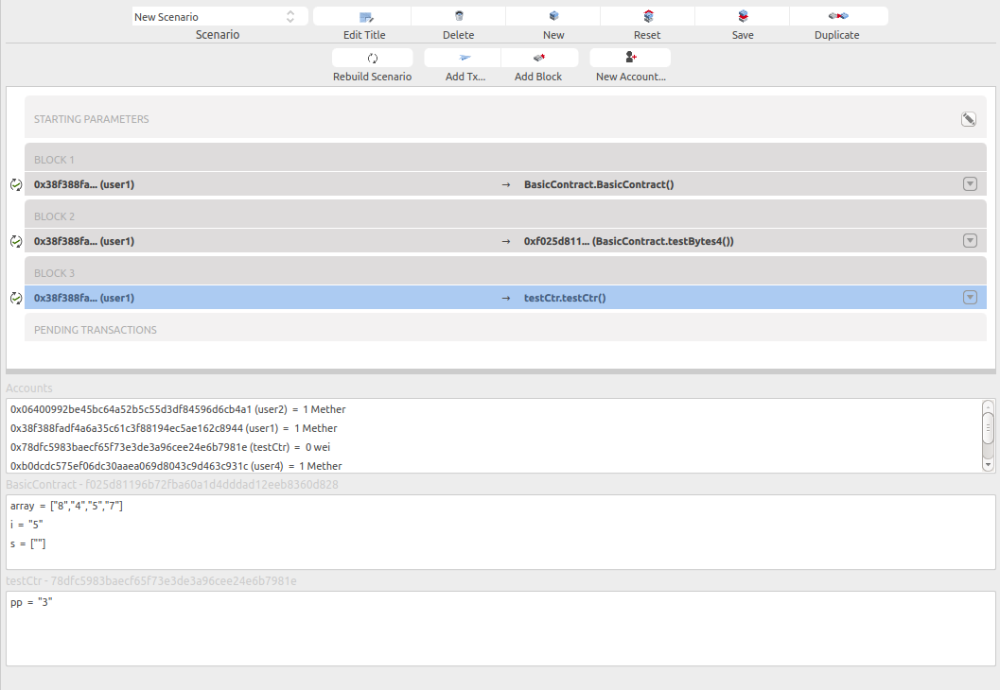

# State Viewer

This panel is located below the block chain panel, in the scenario view.
Once the blockchain has been run, this panel shows the state of the blockchain.

By state we mean all accounts balance (including contract and normal account), and the storage (global variable of all deployed contract).
The content of this panel is not static, it depends on the selected transaction on the blockchain panel.
The state shown here is the state resulting of the execution of the selected transaction.

In that case, 2 contracts are deployed, the selected transaction (deployment of testCtr) is the last one. so the state view shows the storage of both TestCtr and BasicContract.
